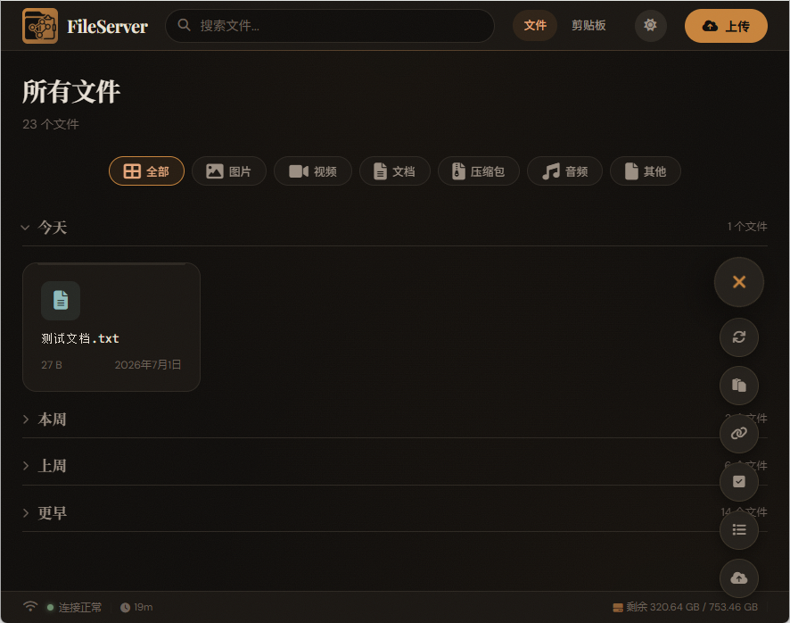

<p align="center">
	
</p>


<h1 align="center">FileServer</h1>

<p align="center">FileServer 是一个浏览器即可使用的<strong>局域网</strong>跨设备文件传输 + 轻量剪贴板同步工具。<br>
它无需联网，一次部署，永久使用。手机扫码即连，支持公网域名，内外兼容。</p>

## 主要功能

+ 文件上传（内网直传 / 外网分片自适应）、批量压缩打包并下载、删除、重命名
+ 在线预览：图片、PDF、音视频、压缩包（ZIP / RAR / 7z / Tar）、文本/代码（高亮编辑器，支持在线编辑保存）
+ 跨设备剪贴板同步（文字 + 链接识别）
+ 提供二维码入口，手机扫码即用
+ 生成文件分享和临时上传入口链接
+ 深 / 浅色主题切换
+ 智能下载：内网直接下载，外网分块 + Blob 拼接下载
+ 文件类型筛选、网格/列表双视图切换
+ 移动端拍照 / 相册直传
+ 查看完整功能清单：[详细功能](#详细功能)

## 支持平台

| 环境       | 系统 / 架构             | 说明                             |
| :--------- | :---------------------- | :------------------------------- |
| **服务端** | Windows 10+ (x64)       | 需 Node.js 18+                   |
|            | macOS 11+ (x64 / arm64) | 需 Node.js 18+                   |
|            | Linux (x64 / arm64)     | 需 Node.js 18+                   |
| **客户端** | 任何现代浏览器          | Chrome / Firefox / Safari / Edge |
|            | 手机浏览器              | iOS Safari / Android Chrome      |

## 快速开始

Windows 用户使用 **CMD** 或 **PowerShell**，Mac 用户使用 **Terminal**。

### 环境检测

```powershell
# 检查 Nodejs 版本
node -v
# FFmpeg 用于视频缩略图预览（非必需）
ffmpeg -version
```

如果未安装，请访问：

+ [Nodejs 下载](https://nodejs.org)
+ [FFmpeg 下载](https://ffmpeg.org/download.html)

### 获取代码

```powershell
# 使用 git 获取代码
git clone https://github.com/Roipyon/FileServer.git
cd FileServer
```

或者直接前往 [Releases](https://github.com/Roipyon/FileServer/releases/tag/v1.0.0) 下载。

### 安装依赖

```powershell
# 基于代码根目录
npm install --registry=https://registry.npmmirror.com
```

### 启动服务

#### 第一次
```powershell
npm run build
npm start
```

#### 之后
```powershell
npm start
```

执行以上步骤后会自动打开浏览器，如无法自动打开，访问**终端处打印的网址**即可。

## 配置（可选）

根目录处 config.json 参数解析：

| 配置项            | 说明                                        | 默认值                |
| :---------------- | :------------------------------------------ | :-------------------- |
| `port`            | 服务端口                                    | `3000`                |
| `root`            | 文件存储根目录                              | `./shared-files`      |
| `cacheTTL`        | 文件列表缓存时间（秒）                      | `5`                   |
| `publicUrl`       | 公网访问地址（配置后可在连接面板切换）      | `""`（空）            |
| `logAccess`       | 是否记录访问日志（写入 `.logs/access.log`） | `false`               |
| `rateLimit`       | 每分钟最大请求数（按 IP 统计，实际按类型分桶） | `5000` |
| `rateLimitWindow` | 限流时间窗口（毫秒）                        | `60000`               |
| `maxUploadSize`   | 单文件上传大小上限（字节）                  | `10737418240`（10GB） |

> **优先级**：`config.json` < 环境变量（环境变量会覆盖配置文件中的同名配置）
>
> 例如：`PORT=3001 npm start` 会覆盖 `config.json` 中的 `port: 3000`

## 开发者模式

如果从源码构建，遵循以下步骤：

```powershell
# 1. 克隆项目到本地
git clone https://github.com/Roipyon/FileServer.git
cd FileServer

# 2. 安装项目依赖
npm install

# 3. 运行应用（开发模式）
npm run dev
```

## 详细功能

| 功能模块       | 说明                                                         |
| -------------- | ------------------------------------------------------------ |
| **文件管理**   | 上传（内网直传 / 外网 1MB 分片自适应）、下载（内网直链 / 外网 Blob 拼接）、删除、重命名、搜索、排序、类型筛选（图片/视频/文档/压缩包/音频/其他）、网格/列表双视图切换、批量打包下载（含进度条及浏览器通知）；上传前重名检测确认；上传后自动定位高亮；批量选择删除；滑动批量选择 |
| **文件预览**   | 图片（缩放、平移、旋转、翻页导航）、PDF（canvas 渲染）、音视频（HTTP Range 拖拽进度）、文本/代码（CodeMirror 6 多语言语法高亮，支持编辑 Ctrl+S 保存）、Markdown（marked 渲染）、压缩包内部目录树（ZIP/ RAR / 7z / Tar）；视频自动截取封面（需 ffmpeg）；音频封面提取（music-metadata）；加密压缩包检测提示；Office 格式暂不支持 |
| **连接与访问** | 终端二维码扫码即用；连接面板一键切换内网/公网地址；自定义临时地址（ngrok/frp 等隧道）自动生成对应二维码；支持 IPv4 与 IPv6 双栈 |
| **剪贴板同步** | 跨设备文字同步；自动识别链接并提供一键打开；按时间分组展示（今天/昨天/本周/更早）；设备名颜色标识；批量删除与清空；快速粘贴（从系统剪贴板读取直接发送） |
| **分享与协作** | 文件分享链接（一次性 / 持续有效）；单向上传链接（只能上传，无法查看文件列表），无需对方登录，服务重启后失效 |
| **运维与可靠** | 磁盘剩余空间显示（上传前检查，不足 500MB 拒绝）；状态栏服务运行时长；启动自动打开浏览器；端口被占用时自动降级；崩溃自动重启（最多 3 次）；日志访问记录（可选）；日志自动轮转；Docker 环境自动检测；临时文件自动清理 |
| **性能与体验** | 内存缓存文件列表（TTL 5s，变更自动失效）；上传速度与剩余时间显示；批量选择删除；图片预览旋转；支持 ETag / 304 缓存优化；深 / 浅色主题；响应式设计；移动端拍照 / 相册直传 |
| **安全性**     | 请求频率限制（按上传/下载/列表/缩略图/分享类型分桶限流，非单一阈值）；文件名路径遍历防护；文件占用锁检测；上传文件大小可配置（默认 10GB）；分享链接无需登录，但纯内存存储随服务关闭失效；`config.json` 与环境变量双重配置 |
